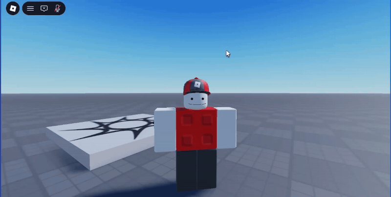
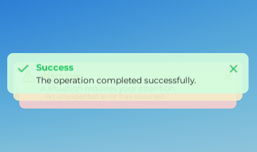
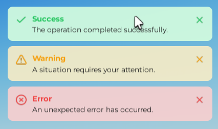

# SimpleToasts

A zero-dependency, [PrimeNG](https://primeng.org/toast)-inspired **toast notification
library for Roblox**.

[](https://github.com/rvila94/SimpleToasts/actions/workflows/ci.yml)
[](https://wally.run/package/rvila94/simpletoasts)
[](LICENSE)



| Collapsed pile (hover to expand)                        | Expanded pile                                         |
| ------------------------------------------------------- | ----------------------------------------------------- |
|  |  |

## Features

- 🎨 **Five severities** : `success`, `info`, `warn`, `error`, `secondary`, each with
  its own colours, icon, and sound (optional); fully overridable per toast via `customTheme`.
- 📍 **Six positions** : `top-left`, `top-center`, `top-right`, `bottom-left`,
  `bottom-center`, `bottom-right`.
- 🥞 **Stacked piles** (Sonner-style, on by default) : newest toast in front, older
  edges peeking behind; hover (desktop) or tap (mobile) expands the pile and pauses
  every timer in it.
- ⏱️ **Auto-dismiss** with `life`, `sticky` toasts, close button, and pause-on-hover.
- 🎬 **Smooth animations** : slide-in/out from the nearest screen edge + fade, with
  tweenable neighbour reflow; duration and easing are configurable.
- 🔊 **Sounds** (opt-in) : per-severity defaults, per-toast override (`sound`,
  `silent`, `volume`), global toggle.
- 🌐 **Server → client bridge** : fire toasts from the server with `Toast.notify` /
  `Toast.notifyAll` (display-only; the client never trusts remote data for anything
  else).
- 🧱 **Zero dependencies** : native Luau instances only (`CanvasGroup`, `TweenService`,
  …). No Fusion, Roact, or React-lua. Fully `--!strict` typed.

## Installation

### Wally

```toml
[dependencies]
SimpleToasts = "rvila94/simpletoasts@0.1.0"
```

Then run `wally install` and require it from your `Packages` folder.

### Standalone model

Build a `.rbxm` with [Rojo](https://rojo.space) and drop it anywhere your scripts can
reach (e.g. `ReplicatedStorage`):

```bash
rojo build default.project.json -o SimpleToasts.rbxm
```

## Quick start

```lua
local ReplicatedStorage = game:GetService("ReplicatedStorage")
local Toast = require(ReplicatedStorage.Packages.SimpleToasts)

-- Convenience shortcuts: (summary, detail?, options?)
Toast.success("Saved!", "Your progress has been saved.")
Toast.info("Heads up")
Toast.warn("Storage almost full", nil, { position = "bottom-center" })
Toast.error("Something went wrong", "Please try again later.", { life = 8000 })
Toast.secondary("Background task finished")
```

### Full message form

```lua
Toast.add({
	severity = "success",   -- "success" | "info" | "warn" | "error" | "secondary"
	summary  = "Title",
	detail   = "Optional body text",
	life     = 4000,        -- ms before auto-dismiss (default: 3000)
	sticky   = false,       -- true = never auto-dismiss
	closable = true,        -- show the close button (default: true)
	position = "top-right", -- one of the six positions (default: "top-right")

	-- Appearance override (all colours/icon/sound of the severity theme):
	customTheme = {
		backgroundColor = Color3.fromRGB(249, 219, 159),
		accentColor = Color3.fromRGB(209, 152, 38),
		detailTextColor = Color3.fromRGB(30, 30, 30), -- omit for the default dark grey
		iconAssetId = "rbxassetid://...", -- omit to show no icon
	},

	-- Sound (all optional; sounds are off by default, see configure below):
	sound  = "rbxassetid://...", -- plays even when soundEnabled = false
	silent = false,              -- true = suppress sound for this toast
	volume = 0.8,                -- 0-1, overrides defaultVolume
})

-- Several at once:
Toast.addAll({ message1, message2 })

-- Remove every visible toast (optionally only one position):
Toast.clear()
Toast.clear("bottom-right")
```

### From the server

```lua
-- Fire a toast to one player, or to everyone:
Toast.notify(player, { severity = "success", summary = "Welcome!" })
Toast.notifyAll({ severity = "info", summary = "Server restart in 5 minutes" })
```

The bridge is server → client only, created lazily on first use (a `RemoteEvent` in
`ReplicatedStorage`). The client only ever _displays_ what it receives.

## Configuration

`Toast.configure()` merges overrides into the active config at runtime. Defaults shown:

```lua
Toast.configure({
	-- Behaviour
	defaultLife = 3000,            -- ms
	defaultPosition = "top-right",
	defaultClosable = true,
	maxVisible = 5,                -- cap per position

	-- Stacked piles
	stacked = true,                -- false = classic vertical list
	expandedCount = 3,             -- toasts shown when a pile is expanded

	-- Animation & appearance
	animationDuration = 0.25,      -- seconds per animation phase
	animationEasing = Enum.EasingStyle.Quint,
	backgroundTransparency = 0.08, -- card background (0 = opaque)
	fontSize = 14,
	fontFace = Font.fromEnum(Enum.Font.Gotham), -- summary text uses its Bold weight

	-- Sounds
	soundEnabled = false,          -- true = play per-severity sounds automatically
	defaultVolume = 0.5,
})
```

### Severity themes

| Severity    | Background | Accent                |
| ----------- | ---------- | --------------------- |
| `success`   | `#F0FDF4`  | `#4ADE80` / `#16A34A` |
| `info`      | `#EFF6FF`  | `#60A5FA` / `#2563EB` |
| `warn`      | `#FFFBEB`  | `#FBB024` / `#D97706` |
| `error`     | `#FEF2F2`  | `#F87171` / `#DC2626` |
| `secondary` | neutral    | neutral               |

Every theme (colours, icon, sound) can be replaced globally through
`Toast.configure({ themes = ... })` or per toast with `customTheme`. The
`themes` table passed to `configure` is merged per severity: severities you
omit keep their current theme.

## Running the demo

The repository ships with a keyboard-driven demo place:

```bash
rojo serve demo.project.json
```

Connect from Roblox Studio with the Rojo plugin, press Play, then:

| Key                 | Action                                                   |
| ------------------- | -------------------------------------------------------- |
| `1`-`6` (or numpad) | success · info · warn · error · secondary · custom theme |
| `Shift`             | target the **top-right** corner (default)                |
| `Ctrl`              | target the **bottom-right** corner                       |

The demo server script also fires a welcome toast to each joining player to exercise
the server bridge.

## Development

Tooling is pinned with [Rokit](https://github.com/rojo-rbx/rokit):

```bash
rokit install

selene src demo          # lint
stylua --check src demo  # formatting
rojo sourcemap demo.project.json -o sourcemap.json
luau-lsp analyze --definitions=globalTypes.d.luau --sourcemap=sourcemap.json src demo
```

(`globalTypes.d.luau` comes from
[luau-lsp](https://raw.githubusercontent.com/JohnnyMorganz/luau-lsp/main/scripts/globalTypes.d.luau).)

All four checks run in CI on every push and pull request.

## License

[MIT](LICENSE) © rvila94
